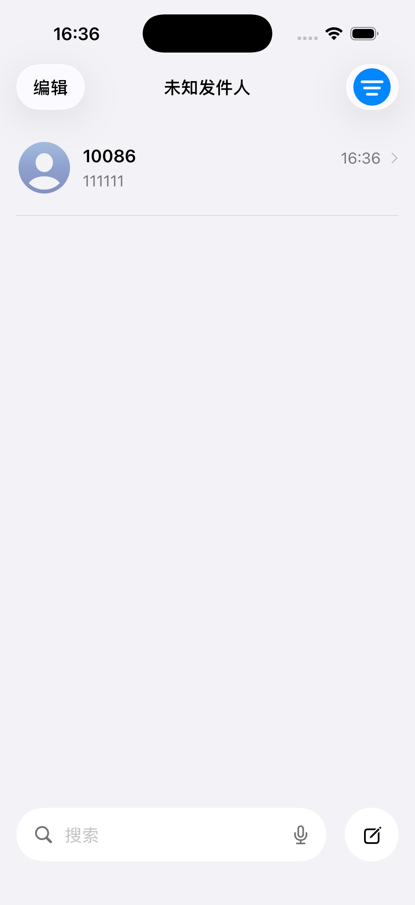
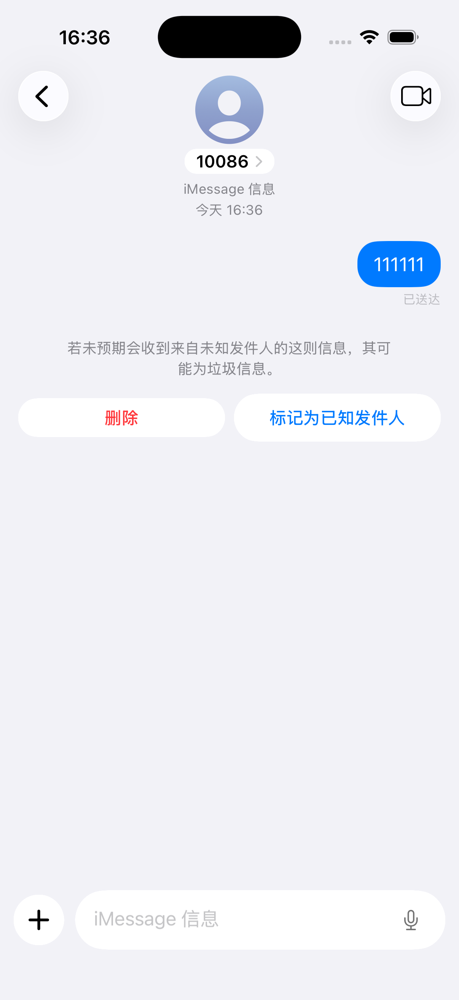
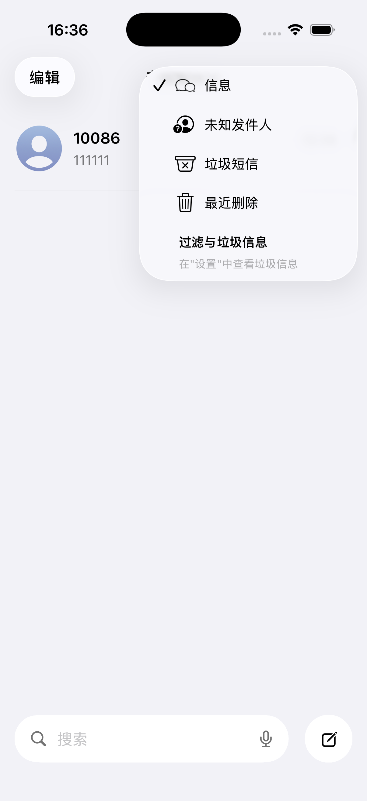
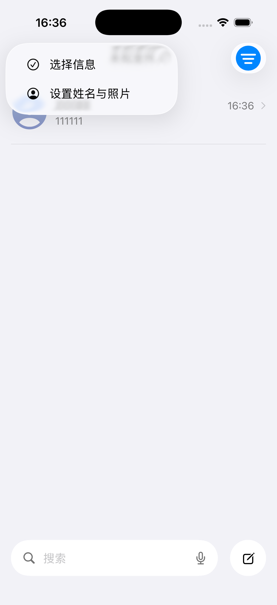
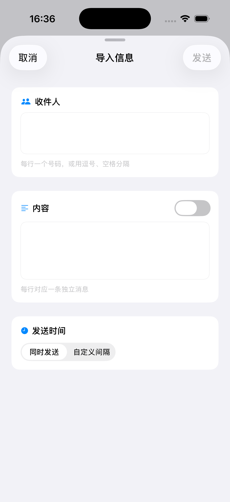

# iMessage

> 基于 SwiftUI 构建的 iOS 模拟 iMessage 应用，支持模拟发送消息、批量导入、筛选过滤和软删除功能。

## 应用概述

iMessage 是一个使用纯 SwiftUI 构建的 iOS 模拟应用，用于模拟 Apple iMessage 的消息收件箱体验。该应用完全使用 Apple 原生框架，不依赖任何第三方库，通过 `UserDefaults` 实现数据持久化。

## 技术栈

| 类别 | 技术 |
|------|------|
| **语言** | Swift 5.0 |
| **UI 框架** | SwiftUI |
| **最低 iOS 版本** | iOS 26.0 (iPhone) / iOS 26.2 (iPad) |
| **平台** | iPhone & iPad（通用应用） |
| **状态管理** | `@Observable` + `ObservableObject` |
| **数据持久化** | UserDefaults (Codable JSON) |
| **第三方依赖** | 无（仅使用 Apple 原生框架） |

## 项目结构

```
iMessage/
├── iMessage.xcodeproj/          # Xcode 项目文件
├── iMessage/                     # 源代码根目录
│   ├── iMessageApp.swift         # @main 应用入口
│   ├── ContentView.swift         # 根视图
│   ├── Extensions/
│   │   └── Color+Theme.swift     # 颜色主题与多态支持
│   ├── Models/
│   │   ├── Conversation.swift            # 会话数据模型
│   │   ├── ConversationStore.swift       # 全局会话状态管理 + 持久化
│   │   ├── MessageInboxFilter.swift     # 收件箱筛选枚举
│   │   ├── OutgoingChatMessage.swift    # 发送消息模型
│   │   ├── RecentlyDeletedConversation.swift
│   │   └── RecentlyDeletedStore.swift
│   ├── Utilities/
│   │   └── PhoneFormat.swift    # 中国大陆手机号格式化 (+86)
│   ├── Views/
│   │   ├── ConversationListView.swift        # 收件箱列表（主界面）
│   │   ├── ConversationChatView.swift         # 聊天界面（仅支持发送）
│   │   ├── ConversationNavBarCenterHeader.swift
│   │   ├── DeleteMorphConfirmation.swift     # 删除动画系统
│   │   ├── FilterAnimation.swift             # 筛选模糊过渡动画
│   │   ├── ImportMessagesView.swift          # 批量消息导入表单
│   │   ├── InboxFilterPopoverButton.swift    # 筛选菜单按钮
│   │   └── RecentlyDeletedView.swift         # 最近删除界面
│   └── Assets.xcassets/          # 应用图标与资源
└── img/                         # 演示截图
```

## 演示截图

以下为应用主要界面的运行截图：

 
*收件箱列表界面 &nbsp;&nbsp;&nbsp;&nbsp;&nbsp;&nbsp;&nbsp;&nbsp;&nbsp;&nbsp;&nbsp;&nbsp;&nbsp;&nbsp;&nbsp;&nbsp;&nbsp;&nbsp;&nbsp;&nbsp;&nbsp;&nbsp;&nbsp;&nbsp; 聊天消息界面*

 
*筛选过滤界面 &nbsp;&nbsp;&nbsp;&nbsp;&nbsp;&nbsp;&nbsp;&nbsp;&nbsp;&nbsp;&nbsp;&nbsp;&nbsp;&nbsp;&nbsp;&nbsp;&nbsp;&nbsp;&nbsp;&nbsp;&nbsp;&nbsp;&nbsp;&nbsp; 最近删除回收站*


*批量导入消息表单*

## 主要功能

### 收件箱列表 (`ConversationListView`)
- 展示所有会话，按最后更新时间倒序排列
- 支持搜索过滤
- 长按拖拽进入多选模式
- 批量删除会话
- 筛选分类：全部 / 短信 / 未知 / 垃圾 / 已删除

### 聊天界面 (`ConversationChatView`)
- 显示发出的蓝色聊天气泡
- 底部文本输入栏
- 垃圾短信提示区域
- 纯发送模拟（不支持接收消息）

### 批量导入 (`ImportMessagesView`)
- 从手机号列表批量导入消息
- 可配置发送时间间隔
- 可选随机分配时间

### 最近删除 (`RecentlyDeletedView`)
- 软删除回收站，保留 40 天
- 支持恢复或永久删除
- 倒计时显示删除期限

### 动画系统
- **FilterAnimation** - 筛选切换时的模糊渐入动画
- **DeleteMorphConfirmation** - 删除时的圆形扩散至面板过渡动画

### 主题与配色 (`Color+Theme.swift`)
- 完整的颜色调色板
- 支持浅色 / 深色模式
- 消息气泡渐变、玻璃拟态效果、头像渐变

## 构建与运行

### Xcode（推荐）

1. 使用 Xcode 打开 `iMessage.xcodeproj`
2. 选择模拟器（iPhone 或 iPad）
3. 按 `Cmd + R` 构建并运行

### 命令行构建

```bash
cd /Users/clozhi/Downloads/源码/APP/iMessage/iMessage
xcodebuild -project iMessage.xcodeproj \
  -scheme iMessage \
  -configuration Debug \
  -destination 'platform=iOS Simulator,name=iPhone 16' \
  build
```

## 应用配置

| 配置项 | 值 |
|--------|-----|
| **Bundle ID** | `com.CloZhi.iMessage` |
| **开发团队** | CLOZHI TECHNOLOGY |
| **Swift 版本** | 5.0 |
| **代码签名** | 自动（Development） |
| **本地化** | String Catalogs (`STRING_CATALOG_GENERATE_SYMBOLS = YES`) |

## 数据存储

应用使用 `UserDefaults` 存储所有数据，通过 `Codable` 协议实现 JSON 序列化：

- **ConversationStore** - 存储会话列表
- **RecentlyDeletedStore** - 存储已删除的会话（40 天后自动清除）

## 开发者说明

本项目为教学演示 / 个人项目用途，完全使用原生框架实现，未引入 CocoaPods、Swift Package Manager 或 Carthage 等依赖管理工具。
